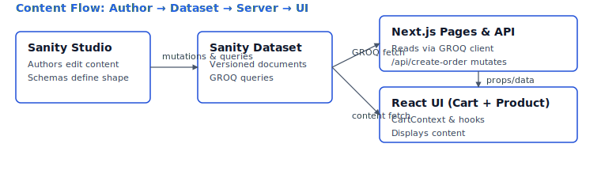

# Sanity E-Commerce Starter (Lean + Extensible)

> Lean Sanity + Next.js e‑commerce seed: schemas, transactional order API, validation, wishlist (with graceful fallback mode).


 


<p>
  
</p>

Clean Sanity schemas + minimal Next.js demo showing products, cart, wishlist, and a transactional order flow. Opinionated enough to learn quickly, small enough to bend.

## Core Features

- Product, Category, Discount, Order, User, Wishlist schemas
- Inventory snapshot + low stock alert fields
- Single order creation API (with discount + inventory decrement)
- Zod validation (product & order)
- Lightweight cart context + product list/detail pages
- Type generation fallback (works even if official codegen fails)

## Installation

### Option 1: NPM Package (Recommended)
```bash
# Install the starter kit
npm install sanity-ecommerce-starter

# Or with your preferred package manager
pnpm add sanity-ecommerce-starter
yarn add sanity-ecommerce-starter
```

### Option 2: Clone Repository
```bash
git clone https://github.com/Ahmed-KHI/sanity-starter-kit.git
cd sanity-starter-kit
npm install
cd example-nextjs && npm install && cd ..
```

## 5‑Minute Start

### Add Sanity Studio (if not already)

If you don't already have a studio, initialize one (Sanity v3):

```bash
npm create sanity@latest -- --ts
```

Place/merge the contents of `schemas/` into your studio's schema folder and export `schemaTypes`.

### Configure Environment Variables

## Usage

### Using the NPM Package

```typescript
// Import schemas in your Sanity studio
import { schemaTypes } from 'sanity-ecommerce-starter/schemas'

// Import validation schemas
import { productValidation } from 'sanity-ecommerce-starter/validation'

// Use in your sanity.config.ts
export default defineConfig({
  // ... other config
  schema: { types: schemaTypes }
})
```

### Configure Environment Variables

For the demo Next.js app create `.env.local` inside `example-nextjs/`:

```
NEXT_PUBLIC_SANITY_PROJECT_ID=yourProjectId
NEXT_PUBLIC_SANITY_DATASET=production
```

### Health Check & Seed (Optional)

Environment sanity:
```bash
node scripts/health-check.ts
```
Seed sample data (categories + products):
```bash
node scripts/seed.ts
```

### Run the Demo Frontend

```bash
cd example-nextjs
npm run dev
```

## Schema Overview

| Document | Purpose                               |
| -------- | ------------------------------------- |
| Category | Organize products                     |
| Product  | Core product data, pricing, inventory |
| User     | Customer/admin/seller |
| Order    | User purchases & line items           |
| Wishlist | Separate wishlist document (optional) |
| Discount | Promotion codes & validity window     |

## You’ll Learn

- Modeling products, orders, discounts & wishlist documents in Sanity
- Validating and enforcing invariants with Zod
- A minimal transactional-style order mutation (multi-document changes)
- Fallback placeholder mode when project ID not configured
- Optimistic UI wishlist toggle with memory fallback
- Mixed code generation strategy: official, custom heuristic, minimal fallback

## Extending / Customizing

Common extension ideas:

- Add `brand` reference to `product`
- Add `SEO` object (title, description, ogImage)
- Add `shippingAddress` & `billingAddress` to `order`
- Add `variant` structure (size, color) to `product`
- Add `maxUsesPerUser` to `discount`

Example add a brand reference to product:

```ts
// product.ts add inside fields
defineField({
  name: "brand",
  title: "Brand",
  type: "reference",
  to: [{ type: "brand" }],
});
```

Then create `brand.ts` document and include in `schemaTypes`.

## Example GROQ Queries

Fetch products:

```groq
*[_type == "product"]{ _id, name, 'slug': slug.current, price, badge, 'category': category->name } | order(_createdAt desc)
```

Single product by slug:

```groq
*[_type == "product" && slug.current == $slug][0]{ _id, name, price, priceWithoutDiscount, description, features, dimensions, inventory }
```

Orders for a user:

```groq
*[_type == "order" && user._ref == $userId]{ _id, status, paymentStatus, totalAmount, createdAt }
```

## Order Creation Flow

The example Next.js app includes a POST endpoint at `/api/create-order`.

Request body JSON:

```json
{
  "userId": "<sanityUserDocumentId>",
  "products": [{ "productId": "<productId>", "quantity": 2 }],
  "discountCode": "SUMMER20" // optional
}
```

Response shape:

```json
{
  "orderId": "<newOrderId>",
  "totalAmount": 123.45,
  "subtotal": 150,
  "discountAmount": 26.55
}
```

Validation:

- Uses Zod (`OrderInputSchema`) for structural validation
- Re-fetches live product prices to prevent client tampering
- Applies discount logic (percentage or fixed)

To test (after running `npm run dev` in `example-nextjs`):

```bash
curl -X POST http://localhost:3000/api/create-order \
  -H "Content-Type: application/json" \
  -d '{"userId":"USER_ID","products":[{"productId":"PRODUCT_ID","quantity":1}],"discountCode":"CODE"}'
```

## Validation Example

```ts
import { ProductInputSchema } from "../validation/productSchema";

function createProduct(input: unknown) {
  const data = ProductInputSchema.parse(input); // throws if invalid
  // persist via Sanity mutation
}
```

## Typing / Codegen

If official codegen works in your environment:
```bash
npm run codegen
```
If not, fallback custom heuristic types:
```bash
npm run codegen:custom
```
Exports basic interfaces + `SanityDocumentUnion`.

## Extension Points

- Add product fields (brand, dimensions, variants)
- Enrich order with shipping/billing objects
- Replace auth mock with NextAuth / Clerk
- Swap rate limiter for Redis/Upstash
- Add webhooks (payment provider / fulfillment)
- Convert API routes to Route Handlers or server actions

## Minimal API Included

Retained:

- `POST /api/create-order` – core transactional order flow.
- `POST /api/wishlist-toggle` – optional wishlist demo (safe to remove for strict minimalism).

Removed (available via history / recipes): discount preview, inventory adjust, payment status, orders listing.

## Remove / Optional

- `scripts/seed.ts` once you have real catalog data
- `example-nextjs/pages/api/wishlist-toggle.ts` to omit wishlist demo
- `generated/` (regenerate anytime with codegen scripts)
- `tests/` (keep for confidence; remove only for ultra‑minimal footprint)

## License

MIT

## Demo Auth & Guards (Optional Layer)

The example includes naive auth header parsing, simple CSRF & in‑memory rate limiting for teaching purposes. Safe to remove—all are clearly marked non‑production.

## Verification

Type + tests:
```bash
npm run verify
```
Environment + product count:
```bash
node scripts/health-check.ts
```

## Publishing (Optional)

Build outputs to `dist/`:

```
npm run build
```

Consumers can:

```ts
import { schemaTypes } from "sanity-ecommerce-starter";
```

## Roadmap / Ideas

| Feature | Status |
|---------|--------|
| Core schemas & order flow | ✅ |
| Wishlist (demo + fallback) | ✅ |
| Health check script | ✅ |
| Additional screenshots / GIF | ⏳ |
| CI workflow | ✅ |
| Release workflow | ✅ |
| Coverage reporting | Partial |
| CodeQL security scan | ✅ |
| Live demo deploy | ⏳ |
| Real auth integration recipe | Planned |
| Redis rate limiting example | Planned |
| Payment webhook example | Planned |
| GROQ typed response helpers | Planned |
| Additional API-level tests | In progress |

## Security Disclaimer

## FAQ (Why Not X?)

**Why no full auth solution baked in?**  Auth is highly app-specific (providers, roles, SSO). A stub keeps the starter neutral; recipes point to integration ideas.

**Why not bundle real payment integration?**  Payment flows (Stripe, Paddle, etc.) add config + webhook complexity. Keeping it out lets you adopt your provider cleanly later.

**Why a fallback / custom codegen instead of only the official one?**  Some Windows + CI environments can’t execute the binary reliably. Fallback ensures typings never block adoption while encouraging proper codegen when available.

**Why only one core API (create order)?**  A single end‑to‑end example teaches schema → query → validate → transactional mutation without overwhelming new users.

**Why keep optional routes instead of deleting them?**  They live as learning references; you can remove them (see Delete If Not Needed) or treat them as recipes.

**Why no complex UI library or design system?**  Simplicity keeps focus on content modeling and data flow—users can layer any UI system later.

**Can I safely delete generated types?**  Yes. Run codegen or `codegen:custom` later to restore minimal typings.

**Where are the advanced examples now?**  See `RECIPES.md`.

This starter includes simplified auth, CSRF, and rate limiting purely for demonstration. Do not deploy as‑is for production security needs. Replace each with production equivalents before going live.

### Production Hardening Checklist (Quick Reference)
- Replace mock auth with real session/JWT provider
- Implement robust CSRF & input validation at framework boundary
- Move rate limiting + stateful counters (discount usage) to Redis or durable store
- Add logging & monitoring (request IDs, structured logs)
- Ensure tokens use least privilege & rotate regularly
